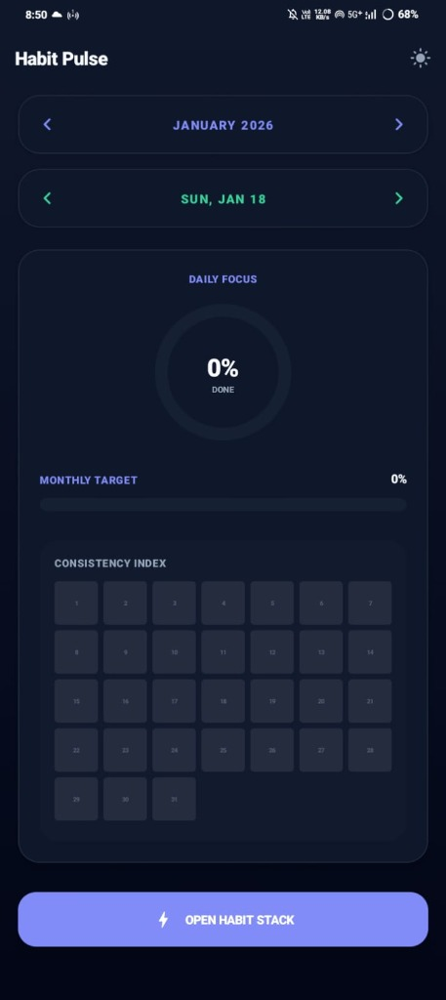
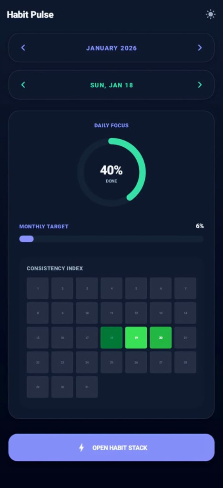
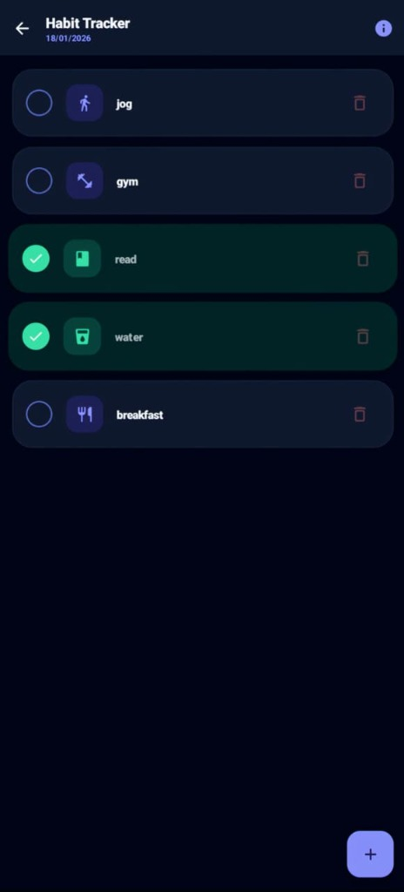
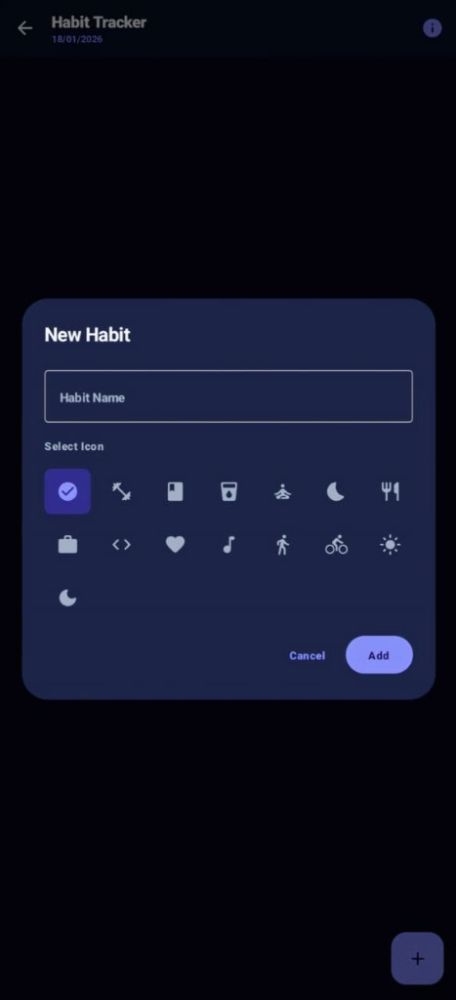

<p align="center">
  
</p>

# 📈 Habit Pulse: Premium Habit Tracker

A high-performance, visually stunning Android application designed to transform habit tracking into a rewarding visual experience. Built with **Kotlin**, **Jetpack Compose**, and the **Google Sheets API**.

[ ](https://github.com/yashh1975/habit-tracker-android-application-/raw/main/HabitPulse_Premium.apk)

---

## 📱 App Experience

### **User Interface Gallery**

| **Dashboard (Empty)** | **Dashboard (Progress)** | **Progress Insights** |
| :---: | :---: | :---: |
|  |  |  |

| **Habit Stack** | **Icon Customization** |
| :---: | :---: |
|  |   |

---

## 🚀 Application Access Guide

Follow these steps to get your personal habit tracker up and running in minutes:

### **Step 1: Install the Application**
Click the **[INSTALL | HABIT PULSE](https://github.com/yashh1975/habit-tracker-android-application-/raw/main/HabitPulse_Premium.apk)** button at the top of this page to download and install the APK on your Android device.

### **Step 2: Authenticate with Google**
Open the app and click **Login**. Sign in with your preferred Google account. This ensures your data is securely stored in your own Google Drive.

### **Step 3: Connect Your Spreadsheet**
1.  Create a new **Google Sheet** in your Drive.
2.  Copy the **Spreadsheet ID** from the URL (the long string between `/d/` and `/edit`).
3.  Paste this ID into the **Setup Screen** within the app when prompted.

### **Step 4: Build Your Habit Stack**
Click the **+** button to add your first habit. Choose from our custom icon library (Fitness, Reading, Zen, etc.) to give your goals a unique pulse!

---

## 📄 Problem Statement

Consistency is the cornerstone of progress, yet most habit trackers feel like chores. They lack immediate visual feedback and often lock your data in proprietary silos. 

**Habit Pulse** addresses this by blending the iconic **GitHub Contribution Grid** with a personalized, cloud-synced dashboard. It provides a "Consistency Index" that scales from a deep slate to a vibrant **Neon Green**, turning your daily discipline into a work of art.

---

## ✨ Key Features

*   📊 **GitHub-Style Vibrancy Heatmap**: A 30-day "Consistency Index" that visually represents your progress through color intensity.
*   🎨 **Custom Icon Library**: Choose from 15+ curated icons (Fitness, Zen, Code, Brain, etc.) to give every habit its own identity.
*   🌙 **Obsidian Dark Theme**: A premium, high-contrast dark mode tailored for late-night productivity and aesthetic excellence.
*   ☁️ **Google Sheets Backend**: Zero-database architecture—your Google Sheet *is* your database. Secure, private, and accessible anywhere.
*   💎 **Premium UI/UX**: Overhauled with Glassmorphic surfaces, spring-based micro-animations, and a sleek Obsidian & Indigo design system.
*   🗑️ **Advanced Deletion Flow**: Dual-path logic allowing you to either "Hide For Today" or "Permanently Delete" habits.
*   ⚡ **Lag-Free Optimistic Sync**: UI updates instantly while the Google Sheets API synchronizes data in the background.
*   📱 **Navigation Fluidity**: Professional spring-based slide transitions between the Dashboard, Tracker, and Insights screens.

---

## 🏗️ Design Architecture

The application follows the **MVVM (Model-View-ViewModel)** architectural pattern, ensuring a clean separation of concerns and a highly reactive user interface.

- **View (UI Layer)**: Built entirely with **Jetpack Compose**, utilizing a single-activity architecture with a professional `NavHost` for fluid transitions.
- **ViewModel**: Manages the UI state using **StateFlow**, reacting to user interactions and bridge communication with the repository.
- **Model (Data Layer)**: Handles data orchestration between the local memory store and the **Google Sheets REST API**. It uses **Kotlin Coroutines** and `Mutex` locks to ensure thread-safe, non-blocking synchronization.

---

## 📂 Project Structure

```bash
app/src/main/java/com/habittracker/
├── data/
│   ├── model/          # Habit and Month data entities
│   ├── remote/         # Retrofit API interfaces (Google Sheets v4)
│   └── repository/     # Logic for Cloud & Local data orchestration
├── ui/
│   ├── components/     # Reusable UI widgets (Heatmap, Habit Items)
│   ├── screens/        # Main screen composables (Home, Stats, Tracker)
│   └── theme/          # Custom "Obsidian & Indigo" Design System
├── util/               # Session management and constants
├── viewmodel/          # State management logic
└── MainActivity.kt     # App entry point and Navigation setup
```

---

## 🎨 Technology Stack

*   **Language**: Kotlin 1.9+
*   **UI Framework**: Jetpack Compose (Material 3)
*   **Networking**: Retrofit 2 + Gson
*   **Authentication**: Google OAuth 2.0
*   **Async**: Coroutines & Flow

---

## 📈 Performance & Accuracy

| Metric | Accuracy / Stability |
| :--- | :--- |
| **Consistency Calculation** | 100% (Excludes Hidden Habits) |
| **Sync Speed** | < 500ms (Optimistic UI) |
| **Build Warnings** | 0 (Clean Repository Code) |
| **UI Responsiveness** | 60 FPS (Spring-based Animations) |

---

## 📜 License

This project is developed for **educational and productivity purposes**. All personal data remains exclusively within the user's controlled Google Drive environment.

---

## 👤 Author

**Yash**
*Consistency is the pulse of achievement.* 📈🔥
